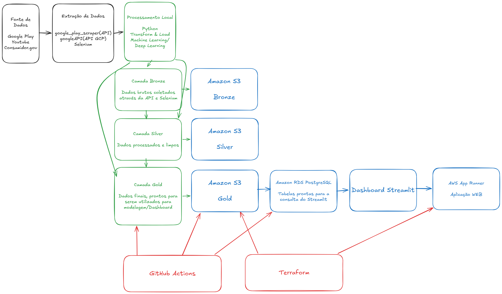

# Etapa 0 — Proposta do Grupo

## 1. Integrantes

| Nome completo             |   RA     |
| ------------------------- |----------|
| Lucca Queiroz             | 5169980  |
| Lissa Ferreira Massuda    | 5170287  |
| Róbson de Oliveira Cabral | 5169870  |
| Sidnário Oliveira Rosa    | 5170099  |

---

## 2. Tema escolhido

**Análise de Sentimentos sobre o Nubank, com intuito de promover insights da visão geral sobre o serviço prestado, seja para colaboradores ou usuários**

---

## 3. O que a aplicação vai fazer

A aplicação tem como objetivo analisar comentários, avaliações e reclamações públicas relacionadas ao Nubank, utilizando dados de fontes como Google Play, YouTube e Consumidor.gov.br. O projeto realiza a coleta, organização e tratamento dos dados em camadas, seguindo uma arquitetura do tipo Medalhão: bronze, silver e gold. Após o tratamento, são aplicadas técnicas de Machine Learning e Deep Learning, incluindo modelos de análise de sentimentos, para classificar os textos como positivos, negativos ou neutros, dividindo em tópicos específicos para tomada de decisão

---

## 4. Rascunho da arquitetura

  

  <em>Figura 1 — Arquitetura da solução de análise de sentimentos utilizando AWS, S3, RDS, Streamlit, GitHub Actions e Terraform.</em>

---
## 5. Serviços AWS que pretendemos usar

### Amazon S3

Será utilizado como armazenamento principal das camadas de dados do projeto. As pastas  bronze e  silver serão armazenadas no S3, além de artefatos como gráficos, relatórios e arquivos finais gerados pelo pipeline.

### Amazon RDS PostgreSQL

Será utilizado para armazenar a camada gold em formato relacional. O dashboard em Streamlit irá consultar o RDS para exibir os dados finais já processados, evitando que a aplicação web precise executar ETL ou modelos de Machine Learning em tempo real.

### AWS App Runner

Será utilizado para hospedar o dashboard Streamlit como uma aplicação web. O deploy será feito como GitHub Action para a etapa de CI/CD

### AWS IAM

Será utilizado para controlar permissões entre os serviços, como acesso ao S3, RDS e App Runner, seguindo o princípio de menor privilégio (Zero Trust).

### AWS Secrets Manager

Será utilizado para armazenar credenciais sensíveis, como usuário e senha do banco, evitando expor essas informações no código ou no repositório GitHub.

---

## 6. Ferramentas auxiliares

Além dos serviços AWS, o projeto pretende utilizar:

* **GitHub Actions** para automatizar o envio dos dados finais, carga no banco e deploy da aplicação.
* **Terraform** para provisionar a infraestrutura na AWS de forma automatizada e versionada.
* **Python** para ETL, Machine Learning, Deep Learning e geração da camada gold.
* **Streamlit** para construção do dashboard interativo.
* **GitHub** para versionamento do código-fonte e integração com o deploy.

---

## 7. Decisão inicial de arquitetura

Como o projeto já possui um pipeline de ETL, Machine Learning e Deep Learning implementado em Python, o grupo optou por não executar o processamento pesado diretamente na aplicação web. O processamento dos modelos, incluindo LinearSVM, Random Forest, Regressão Logística e BERT será realizado localmente. A aplicação Streamlit será responsável apenas por consultar os resultados já processados e exibir os gráficos e indicadores.

Essa decisão reduz custos, pois evita manter instâncias com GPU ou endpoints de Machine Learning ativos na nuvem. Além disso, simplifica o deploy, já que o dashboard fica mais leve e focado apenas em visualização dos dados finais.

---

## 8. Link do repositório GitHub

https://github.com/qLucca/analise_sentimentos
